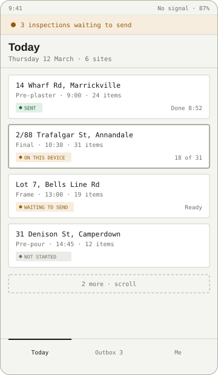
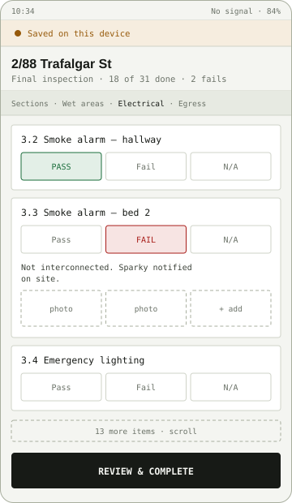
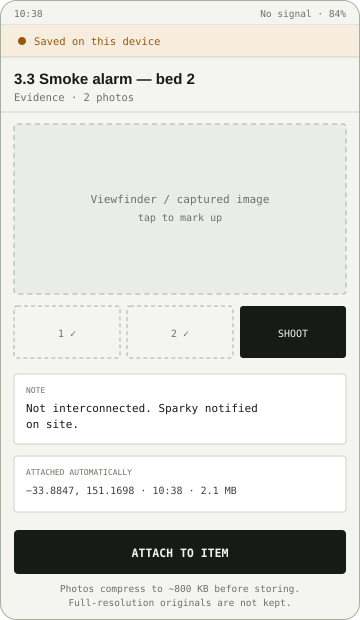
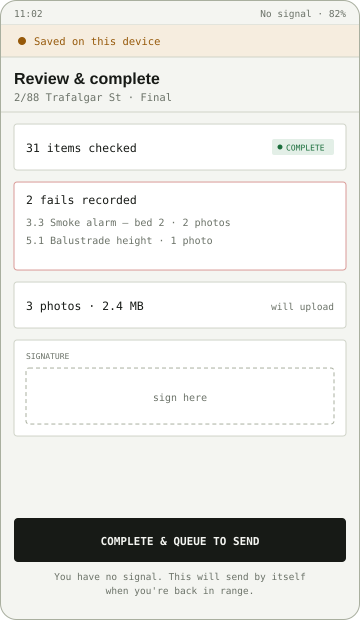
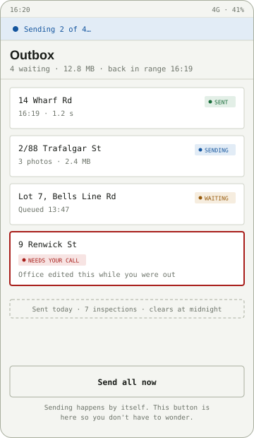
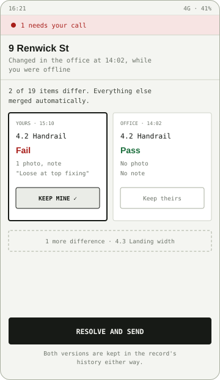

# Sitepad — Initial Design Document

**v0.1 · UI & UX only · pre-build**

| | |
|---|---|
| **Stack** | React · Redux Toolkit · IndexedDB · .NET 10 |
| **Primary device** | Phone, one-handed |
| **Status** | Pre-build |
| **Scope of this doc** | UI/UX. Code design (store shape, DB schema, API contract) to follow. |
| **Wireframes** | [`docs/wireframes/*.svg`](wireframes/) — editable vector source, one file per screen |

An offline-first inspection tool for people who work where the signal isn't. Every design decision below answers one question: *does the inspector ever have to wonder whether their work is safe?*

---

## 1. The premise

A building inspector is handed a list of sites each morning. At each one they walk a checklist — smoke alarms, handrails, water ingress, electrical — marking each item pass, fail, or not applicable, photographing anything that fails, and writing a note. Then they drive to the next one.

Half of those sites are basements, lift shafts, rural blocks, or half-built frames wrapped in foil sarking. There is no connection, and there is no second visit. If the app loses the inspection, someone drives back an hour and re-does it.

So the network is treated as an **eventual** convenience, never a precondition. The phone is the source of truth for the working day; the server is where the day goes when it's done.

---

## 2. Design principles

Five rules that settle arguments.

### 01 — There is no Save button

Every field change writes to IndexedDB on blur or toggle, within the same tick. Kill the app mid-sentence and the sentence is there when it reopens. A Save button implies work can be unsaved, which is the exact anxiety this app exists to remove.

### 02 — Sync state is always on screen

One persistent bar, top of every screen, in the inspector's language: *On this device*, *Sending*, *Sent*, *Needs your call*. Never a spinner with no noun. Never a silent background success.

### 03 — Nothing in the UI waits on a request

Every action resolves against local state immediately and queues the network work behind it. There is no loading state between tapping **Fail** and seeing **Fail**. Latency exists only in the sync bar.

### 04 — Built for glare, gloves, and 6% battery

48 px minimum targets, high-contrast type at 17 px and up, primary actions anchored in the bottom third, no thin grey text, no hover-only affordances, no polling, GPS sampled once per site rather than watched.

### 05 — A conflict is a question, not an error

When the server has moved on, the inspector sees both versions side by side in plain language and picks. No JSON, no "409", no silent last-write-wins, and never a discarded field visit.

---

## 3. The spine — one inspection, five states

This state machine *is* the design. Every screen renders it, the sync bar summarises it, and the Outbox is a list view of it.

```
draft ──▶ queued ──▶ sending ──▶ synced
            ▲           │
            │           ├──▶ conflicted ──▶ (resolve) ──▶ queued
            └───────────┘
              retry w/ backoff
```

| Internal key | What the inspector reads | Meaning |
|---|---|---|
| `draft` | On this device | Being worked on now |
| `queued` | Waiting to send | Finished, no signal yet |
| `sending` | Sending… | Request in flight |
| `synced` | Sent | Server confirmed, safe to clear |
| `conflicted` | Needs your call | Server changed underneath |

`sending` can also fall back to `queued` with a retry count and backoff — the inspector sees "Couldn't send, will retry" rather than a failure they must action. Only `conflicted` ever demands attention, and only `conflicted` is allowed to interrupt.

Chips carry both colour **and** a word, because colour alone fails in direct sun and for the roughly 1 in 12 male inspectors with a colour vision deficiency.

---

## 4. Screens

Six screens, numbered because they genuinely are a sequence — this is the path an inspector walks between 7am and knock-off. Wireframes are structural: real copy, no styling intent.

Each screen has an SVG under [`wireframes/`](wireframes/) — vector, text-based, diffable in git, and openable in Figma, Inkscape, or any browser. The plain-text version is kept alongside it so the doc still reads in a terminal, a diff, or anywhere images don't load.

---

### 01 — Today



<details>
<summary>Plain-text version</summary>

```
┌──────────────────────────────────────┐
│ 9:41                No signal · 87%  │
├──────────────────────────────────────┤
│ ● 3 inspections waiting to send      │  ← sync bar
├──────────────────────────────────────┤
│ Today                                │
│ Thursday 12 March · 6 sites          │
├──────────────────────────────────────┤
│ ┌──────────────────────────────────┐ │
│ │ 14 Wharf Rd, Marrickville        │ │
│ │ Pre-plaster · 9:00 · 24 items    │ │
│ │ [Sent]                Done 8:52  │ │
│ └──────────────────────────────────┘ │
│ ┌══════════════════════════════════┐ │
│ ║ 2/88 Trafalgar St, Annandale     ║ │
│ ║ Final · 10:30 · 31 items         ║ │
│ ║ [On this device]        18 of 31 ║ │
│ └══════════════════════════════════┘ │
│ ┌──────────────────────────────────┐ │
│ │ Lot 7, Bells Line Rd             │ │
│ │ Frame · 13:00 · 19 items         │ │
│ │ [Waiting to send]          Ready │ │
│ └──────────────────────────────────┘ │
│ ┌──────────────────────────────────┐ │
│ │ 31 Denison St, Camperdown        │ │
│ │ Pre-pour · 14:45 · 12 items      │ │
│ │ [Not started]                    │ │
│ └──────────────────────────────────┘ │
│           2 more · scroll            │
├──────────────────────────────────────┤
│   Today   │  Outbox 3  │     Me      │
└──────────────────────────────────────┘
```

</details>

The landing screen and the mental model of the day. Ordered by scheduled time, not by status — inspectors navigate by *where they're driving next*, and re-sorting the list under them destroys that.

- **Row** — Address as the headline, because that's what they match against the windscreen. Type, time, item count beneath. Status chip and progress last.
- **Offline** — The whole day's work (checklist templates, site details, prior defects) is pulled at first load and pinned locally. The list never shows a spinner.
- **Empty** — "Nothing scheduled today." plus a *Check for new jobs* button, not an illustration.
- **Tab bar** — Outbox carries a count badge. It is the only badge in the app, so it means something.

> **Tech**
> **Redux** — normalised `inspections` slice; the list is a memoised selector joining entity + local sync state, so status changes re-render one row, not the list.
> **IndexedDB** — `inspections` store keyed by id, with a `scheduledFor` index so the day is a single `IDBKeyRange` cursor read, not a full scan and filter.

---

### 02 — Inspection



<details>
<summary>Plain-text version</summary>

```
┌──────────────────────────────────────┐
│ 10:34               No signal · 84%  │
├──────────────────────────────────────┤
│ ● Saved on this device               │
├──────────────────────────────────────┤
│ 2/88 Trafalgar St                    │
│ Final inspection · 18 of 31 · 2 fails│
├──────────────────────────────────────┤
│ Sections · Wet areas · Electrical …  │  ← sticky jump row
│ ┌──────────────────────────────────┐ │
│ │ 3.2 Smoke alarm — hallway        │ │
│ │ [ PASS ✓ ] [ Fail ] [ N/A ]      │ │
│ └──────────────────────────────────┘ │
│ ┌──────────────────────────────────┐ │
│ │ 3.3 Smoke alarm — bed 2          │ │
│ │ [ Pass ] [ FAIL ✗ ] [ N/A ]      │ │
│ │ Not interconnected. Sparky        │ │
│ │ notified on site.                 │ │
│ │ [photo] [photo] [+ add]           │ │
│ └──────────────────────────────────┘ │
│ ┌──────────────────────────────────┐ │
│ │ 3.4 Emergency lighting           │ │
│ │ [ Pass ] [ Fail ] [ N/A ]        │ │
│ └──────────────────────────────────┘ │
│        13 more items · scroll        │
├──────────────────────────────────────┤
│        REVIEW & COMPLETE             │
└──────────────────────────────────────┘
```

</details>

Where 90% of the time goes. One long scroll grouped into sections, with a sticky section chip row for jumping — not an accordion, because collapsing hides how much is left and inspectors count remaining items constantly.

- **Pass/Fail** — A three-way segmented control, full width, 48 px tall. Tappable through gloves, unambiguous at arm's length, and no dropdown ever.
- **Progressive** — Marking *Fail* expands the note field and photo strip in place. Passing an item collapses them again but keeps the data — undo is free.
- **Header** — Progress and fail count live in the header so the inspector always knows the shape of the visit without scrolling to the end.
- **Writes** — Each toggle is one persisted mutation. A 31-item inspection is ~31 small writes across the visit, not one large one at the end that can be lost.

> **Tech**
> **React** — the item row is the memoisation test case: 31 rows, one changing. Good excuse to actually read a profiler flamegraph.
> **Redux** — a custom `persistence` middleware sits after the reducer: every action tagged `persist: true` is written to IndexedDB and appended to the outbox. Components never touch the database.

---

### 03 — Capture



<details>
<summary>Plain-text version</summary>

```
┌──────────────────────────────────────┐
│ 10:38               No signal · 84%  │
├──────────────────────────────────────┤
│ ● Saved on this device               │
├──────────────────────────────────────┤
│ 3.3 Smoke alarm — bed 2              │
│ Evidence · 2 photos                  │
├──────────────────────────────────────┤
│ ┌ ─ ─ ─ ─ ─ ─ ─ ─ ─ ─ ─ ─ ─ ─ ─ ─ ┐ │
│    Viewfinder / captured image        │
│         tap to mark up                │
│ └ ─ ─ ─ ─ ─ ─ ─ ─ ─ ─ ─ ─ ─ ─ ─ ─ ┘ │
│  [ 1 ✓ ]     [ 2 ✓ ]     [ SHOOT ]   │
│ ┌──────────────────────────────────┐ │
│ │ NOTE                             │ │
│ │ Not interconnected. Sparky       │ │
│ │ notified on site.                │ │
│ └──────────────────────────────────┘ │
│ ┌──────────────────────────────────┐ │
│ │ ATTACHED AUTOMATICALLY           │ │
│ │ −33.8847, 151.1698 · 10:38       │ │
│ │ 2.1 MB                           │ │
│ └──────────────────────────────────┘ │
├──────────────────────────────────────┤
│         ATTACH TO ITEM               │
│ Photos compress to ~800 KB before    │
│ storing. Originals are not kept.     │
└──────────────────────────────────────┘
```

</details>

Opens from a failed item, never from a global "+". A photo without an item attached is a photo nobody can act on, so the app makes that state unreachable.

- **Storage** — Canvas-downscale to 1600 px long edge and re-encode before writing. The raw 4 MB capture never reaches the database — a day of 40 photos has to fit in a quota, not fight it.
- **Metadata** — GPS and timestamp captured once, shown plainly, and stated as attached. Nothing is collected the inspector can't see on screen.
- **Quota** — Bytes used is surfaced here and in the Outbox. If the browser signals pressure, the app asks to sync before continuing rather than failing on write.

> **Tech**
> **IndexedDB** — the reason it's IndexedDB and not `localStorage`. `Blob`s go in a separate `photos` store keyed by photo id; the inspection record holds ids only, so loading a checklist never pulls image bytes.
> **Render** — `URL.createObjectURL` for thumbnails, revoked on unmount. A leaked object URL here is a real memory bug worth causing once on purpose.

---

### 04 — Review & complete



<details>
<summary>Plain-text version</summary>

```
┌──────────────────────────────────────┐
│ 11:02               No signal · 82%  │
├──────────────────────────────────────┤
│ ● Saved on this device               │
├──────────────────────────────────────┤
│ Review & complete                    │
│ 2/88 Trafalgar St · Final            │
├──────────────────────────────────────┤
│ ┌──────────────────────────────────┐ │
│ │ 31 items checked      [Complete] │ │
│ └──────────────────────────────────┘ │
│ ┌══════════════════════════════════┐ │
│ ║ 2 fails recorded                 ║ │
│ ║ 3.3 Smoke alarm — bed 2 · 2 pics ║ │
│ ║ 5.1 Balustrade height   · 1 pic  ║ │
│ └══════════════════════════════════┘ │
│ ┌──────────────────────────────────┐ │
│ │ 3 photos · 2.4 MB   will upload  │ │
│ └──────────────────────────────────┘ │
│ ┌──────────────────────────────────┐ │
│ │ SIGNATURE                        │ │
│ │ ┌ ─ ─ ─  sign here  ─ ─ ─ ─ ─ ┐  │ │
│ └──────────────────────────────────┘ │
├──────────────────────────────────────┤
│      COMPLETE & QUEUE TO SEND        │
│ You have no signal. This will send   │
│ by itself when you're back in range. │
└──────────────────────────────────────┘
```

</details>

The only moment the app asks for a deliberate commit — and even here, the commit is a state change, not a network call. The button says *queue to send*, not *submit*, because submit is a lie when there's no signal.

- **Copy** — The caption changes with connectivity: offline it explains the queue; online it says "This will send now." Same button, honest label either way.
- **Blocking** — Unanswered items block completion and deep-link back to the first one. Missing photos on a fail warn but don't block — the inspector is standing there and knows better than the form.
- **After** — Returns to Today with the row now reading *Waiting to send*. No modal, no confetti.

> **Tech**
> **Redux** — `completeInspection` transitions `draft → queued` and pushes one outbox envelope containing the record plus its photo ids and the base `version` it was edited from.

---

### 05 — Outbox



<details>
<summary>Plain-text version</summary>

```
┌──────────────────────────────────────┐
│ 16:20                     4G · 41%   │
├──────────────────────────────────────┤
│ ● Sending 2 of 4…                    │
├──────────────────────────────────────┤
│ Outbox                               │
│ 4 waiting · 12.8 MB · in range 16:19 │
├──────────────────────────────────────┤
│ ┌──────────────────────────────────┐ │
│ │ 14 Wharf Rd              [Sent]  │ │
│ │ 16:19 · 1.2 s                    │ │
│ └──────────────────────────────────┘ │
│ ┌──────────────────────────────────┐ │
│ │ 2/88 Trafalgar St     [Sending]  │ │
│ │ 3 photos · 2.4 MB                │ │
│ └──────────────────────────────────┘ │
│ ┌──────────────────────────────────┐ │
│ │ Lot 7, Bells Line Rd  [Waiting]  │ │
│ │ Queued 13:47                     │ │
│ └──────────────────────────────────┘ │
│ ┌══════════════════════════════════┐ │
│ ║ 9 Renwick St                     ║ │
│ ║ [Needs your call]                ║ │
│ ║ Office edited this while you     ║ │
│ ║ were out                         ║ │
│ └══════════════════════════════════┘ │
│  Sent today · 7 · clears at midnight  │
├──────────────────────────────────────┤
│          Send all now                │
│ Sending happens by itself. This      │
│ button is here so you don't wonder.  │
└──────────────────────────────────────┘
```

</details>

The trust screen. It exists so the inspector can answer "is my day actually in?" without calling the office. Borrowed wholesale from email, because everyone already understands an outbox.

- **Automatic** — Sync fires on reconnect and on app foreground; the manual button is reassurance, not the mechanism. It stays enabled offline and explains why nothing happened.
- **Order** — Strictly FIFO. Out-of-order delivery makes server-side conflict detection unreasonable and makes the screen a liar.
- **Retries** — Exponential backoff, capped, with the next attempt time shown. After the cap it becomes actionable — retry or discard, with an explicit confirm.
- **Sent rows** — Linger for the session so the inspector sees the day land, then clear. Local copies of synced records are pruned after 7 days.

> **Tech**
> **IndexedDB** — `outbox` store with an auto-increment key; the key *is* the FIFO order. Survives a hard kill, which a Redux-only queue would not.
> **Redux** — a sync thunk drains the outbox serially against `POST /api/sync`, dispatching per-envelope results. Online/offline listeners dispatch into the same slice, so connectivity is state, not a scattered `navigator.onLine` check.

---

### 06 — Resolve



<details>
<summary>Plain-text version</summary>

```
┌──────────────────────────────────────┐
│ 16:21                     4G · 41%   │
├──────────────────────────────────────┤
│ ● 1 needs your call                  │
├──────────────────────────────────────┤
│ 9 Renwick St                         │
│ Changed in the office at 14:02,      │
│ while you were offline               │
├──────────────────────────────────────┤
│ 2 of 19 items differ. Everything     │
│ else merged automatically.           │
│ ┌────────────────┐┌────────────────┐ │
│ │ YOURS · 15:10  ││ OFFICE · 14:02 │ │
│ │ 4.2 Handrail   ││ 4.2 Handrail   │ │
│ │ Fail           ││ Pass           │ │
│ │ 1 photo, note  ││ No photo       │ │
│ │ "Loose at top" ││ No note        │ │
│ │ ┌────────────┐ ││ ┌────────────┐ │ │
│ │ │ KEEP MINE ✓│ ││ │ Keep theirs│ │ │
│ │ └────────────┘ ││ └────────────┘ │ │
│ └────────────────┘└────────────────┘ │
│   1 more difference · 4.3 Landing    │
├──────────────────────────────────────┤
│          RESOLVE AND SEND            │
│ Both versions are kept in the        │
│ record's history either way.         │
└──────────────────────────────────────┘
```

</details>

The screen that justifies the whole architecture — and the one worth building first, because everything upstream is shaped by it.

- **Framing** — Field-level, not record-level. Auto-merge everything that doesn't collide, then show only the genuine disagreements. Two rows to decide, not thirty-one.
- **Attribution** — Who changed it and when, in words. "Office · 14:02" makes the choice obvious; a version number does not.
- **Bias** — The inspector's version is preselected. They were physically there; the default should reflect that.
- **Reassurance** — Nothing is destroyed — the losing version stays in history. That single line is what makes people willing to press the button.

> **Tech**
> **API** — client sends the base `version` it edited from. On mismatch the server returns `409` with its current record; the client diffs the two locally and renders this screen. No merge logic on the server.
> **Redux** — resolution builds a fresh envelope at the server's new base version and re-queues it, so a resolved conflict re-enters the same pipeline as any other write.

---

## 5. Cross-cutting

**The sync bar.** Full-width, below the status bar, always present, never dismissible. Shows the single most urgent state across all records: conflict beats sending beats waiting beats sent. Tapping it opens the Outbox.

**Connection banner.** No "you are offline" interruption — offline is the normal case, not an error. The sync bar's wording carries it. Regaining signal is worth a brief, quiet confirmation; losing it is not.

**Errors.** Written as cause plus next step: "Couldn't send — the office server didn't answer. Your work is safe on this device. Next try at 16:24." Never a code, never an apology.

**Loading.** Only two places can legitimately show one: first launch of the day, and an explicit pull-to-refresh. Everywhere else, local data renders instantly. A spinner mid-inspection is a bug.

---

## 6. Where each technology earns its place

High level only — no code design yet. The point of the table is that nothing here is decorative; each technology is doing work the others can't.

| Concern | Lives in | Why there |
|---|---|---|
| Server cache | RTK Query | Job list, site details, checklist templates. Read-mostly, server-owned, invalidated by tag. Teaches the distinction between cached server data and owned client state. |
| Local truth | Redux slices | Inspections, items, photo ids, sync status. Normalised via `createEntityAdapter`. This is the app's state, not a cache of anyone's. |
| Durability | IndexedDB | Records, photo blobs, outbox queue. Redux is the working set for this session; IndexedDB is what survives the kill. Rehydrated into the store on boot. |
| Persistence rule | Custom middleware | One place decides what gets written and queued. Keeps components and the database completely unaware of each other. |
| Heavy work | Web Worker | Image downscale and encode. Keeps the checklist responsive while a 4 MB capture is processed. |
| Sync | Thunk + listeners | Drains the outbox on reconnect, foreground, and manual tap. Serial, with backoff. The only code that talks to the network for writes. |
| API | .NET 10 minimal API | CRUD for jobs and inspections, `POST /api/sync` for batched envelopes, presigned or direct photo upload. EF Core with a concurrency token doing conflict detection. Deliberately small. |

### Build order

**Screen 06 first, then 05, then work backwards.** Conflict resolution and the outbox determine the shape of the record, the envelope, and the API — building the checklist first means rewriting it once the merge model lands.

---

## 7. Open questions

- **Conflict granularity.** Per checklist item is assumed above. Per section would mean fewer decisions but coarser losses — worth prototyping both on screen 06 before committing.
- **Photo upload path.** Inline in the sync envelope is simpler; separate multipart upload with the record referencing ids is more honest about failure. Leaning separate.
- **Storage ceiling.** No design yet for what the app does at 90% quota mid-inspection. Blocking new photos is unacceptable; silently degrading quality might be the answer.
- **Multi-device.** Same inspector, phone and tablet. Deliberately out of scope for v1 — it turns a two-party merge into a three-party one.
- **Auth offline.** How long a session stays valid without contact, and what happens to queued work if it expires. Needs a decision before the API is designed.

---

*Sitepad · initial design document · UI and UX only · code design to follow*
