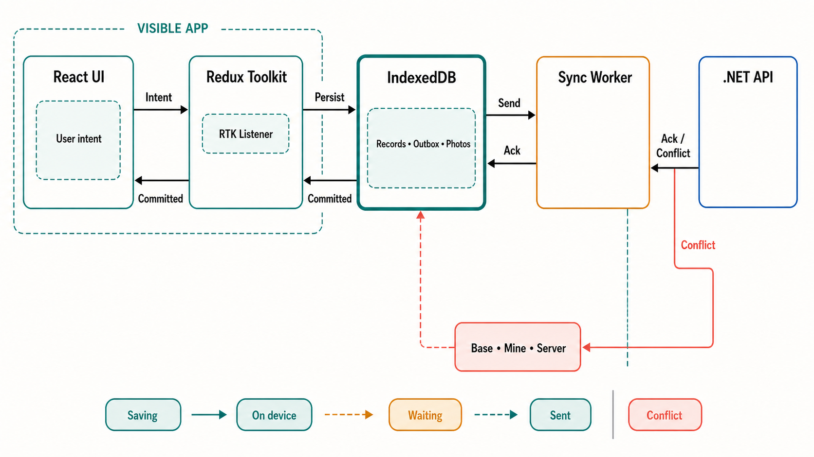

# Office Hours Review: Sitepad v0.1

Generated by `/office-hours` on 2026-09-03  
Branch: `master`  
Mode: Builder  
Status: APPROVED
Reviewed input: [`../design-v0.1.md`](../design-v0.1.md)

## Verdict

The product framing is strong, but the implementation story currently promises more safety than a browser can guarantee. The best next version is not six screens. It is one complete inspection path that makes React state, Redux coordination, IndexedDB durability, sync, and conflict resolution visible and testable.

Keep the field-inspector setting. It gives every technical lesson a reason to exist. Narrow the build until one path is truthful under reloads, lost connectivity, quota failure, server rejection, and conflicting edits.

## Problem Statement

This project is primarily a way to learn React, Redux Toolkit, and IndexedDB by building a realistic offline-first application.

The learning problem is not how to draw six mobile screens. It is how to make one user action travel through a React interface, a Redux state transition, an asynchronous IndexedDB transaction, a durable outbox, and a remote acknowledgement without lying to the user about what is safe.

## What Makes This Cool

The interface looks simple while the system underneath is doing difficult work. One **Fail → Complete** path can teach:

1. immediate React rendering;
2. a serializable Redux action and reducer transition;
3. a Redux listener coordinating an asynchronous write;
4. an IndexedDB transaction becoming durable;
5. an outbox surviving reload and lost connectivity;
6. an API acknowledgement or conflict returning after completion through the same path.

That is a better learning loop than six mostly independent screens.

## Architecture Infographic



The important distinction is the return arrow from IndexedDB. Redux can render an optimistic value immediately, but the interface may say **On device** only after the IndexedDB transaction completes. A server acknowledgement must also be written locally before the interface says **Sent**.

## What v0.1 Gets Right

- **The field setting earns the architecture.** Basements, lift shafts, rural sites, and interrupted connectivity make offline behavior part of the core interaction rather than a decorative feature.
- **The copy is unusually honest.** “On this device,” “Waiting to send,” and “Needs your call” are clearer than generic technical states.
- **The Outbox is the right trust surface.** It gives the inspector somewhere explicit to answer “is my day actually in?”
- **The mobile constraints are concrete.** Large targets, high contrast, bottom-third actions, visible progress, and no hover-only behavior fit the stated environment.
- **The conflict screen exposes the hard problem.** Keeping both versions and showing only genuine disagreements is the right user-facing goal.
- **Separating photo blobs from inspection records is sound.** Checklist reads should not pull image bytes into memory.

## Findings That Must Change

### 1. “Kill the app mid-sentence” is false

The document says notes persist on blur while also promising that killing the app mid-sentence loses nothing. A note that has not blurred has not been written. IndexedDB writes are asynchronous, and mobile lifecycle events cannot be relied upon to rescue the final edit.

Use a short input debounce during typing, persist the latest text while the page is active, and attempt a final flush on `visibilitychange`. The UI should move through **Saving** and then **On device** after transaction completion. Do not claim zero-loss behavior before that acknowledgement.

### 2. Browser storage is not automatically permanent

IndexedDB is best-effort storage by default. Sitepad should request persistent storage with `navigator.storage.persist()`, inspect the result, monitor `navigator.storage.estimate()`, and handle `QuotaExceededError`. If persistence is denied, say so in plain language rather than displaying an unconditional safety promise.

The quota policy also needs an offline path. “Sync before continuing” cannot solve storage pressure when there is no connection. In Milestone 4, simulate quota failure and preserve existing records while refusing only the new photo write.

### 3. Domain state and delivery state are conflated

`draft → queued → sending → synced` mixes two different questions:

- Is the inspection still being edited or has it been completed?
- Has a durable mutation been delivered to the server?

Model them separately:

- Inspection: `in_progress | completing | completed`
- Local durability: `saving | durable | storage_error`
- Outbox entry: `pending | sending | acknowledged | retryable | conflicted | superseded | rejected`

One inspection may have several durable changes and several outbox entries. Separating these axes makes selectors, status copy, retries, and tests much clearer.

### 4. Two versions cannot produce a safe automatic merge

The proposed conflict flow sends a base version number, receives the server record, and compares “the two” locally. A correct three-way merge needs:

1. the base snapshot the inspector started from;
2. the inspector’s edited snapshot or patch;
3. the current server snapshot.

Without the base values, the client cannot tell whether only the office changed a field, only the inspector changed it, or both changed it differently. Preserve the base snapshot or a base-relative patch with the outbox operation.

### 5. Global FIFO creates head-of-line blocking

A single conflicted inspection should not stop unrelated sites from syncing. Preserve order per inspection, not across the entire day. The sync worker may process the earliest ready operation for each inspection while holding later operations for the same inspection until its predecessor is acknowledged.

Use stable operation IDs so retries are idempotent. A lost acknowledgement must not create the same server mutation twice.

### 6. Custom persistence middleware is the wrong default lesson

Redux officially recommends listener middleware for reacting to state changes and long-running asynchronous workflows. Use:

- reducers for synchronous state transitions;
- RTK listener middleware for IndexedDB persistence and outbox orchestration;
- thunks for explicit bounded commands such as **Send now**;
- RTK Query for server-owned reads when the wider app is added.

A small IndexedDB adapter should own database mechanics. React components should dispatch intents and render selectors; they should not call IndexedDB.

### 7. Background delivery is an enhancement

Background Sync is not available consistently across major browsers. The dependable triggers are:

- app start;
- app returning to the foreground;
- a successful request or connectivity probe showing the API is reachable;
- manual retry while the app is open.

A service-worker Background Sync registration can improve delivery on supported browsers, but the UI must never promise that closed-app delivery will occur.

### 8. Conflict choices should not be preselected

Preselecting the inspector’s version makes accidental submission more likely in a compliance workflow. Auto-merge fields changed by only one party. For a genuine same-field collision, require an explicit choice and keep both values in history.

### 9. Unsent work must not have a discard action

Retry exhaustion is not permission to destroy field evidence. Replace **discard** with **keep on device**, **retry**, and eventually **export for support**. A rejected operation remains locally recoverable until the inspector or an administrator deliberately resolves it.

## Current Best-Practice Basis

- IndexedDB data is best effort by default; persistent storage must be requested, usage can only be estimated, and quota overflow raises `QuotaExceededError`: [MDN storage quotas and eviction](https://developer.mozilla.org/en-US/docs/Web/API/Storage_API/Storage_quotas_and_eviction_criteria).
- IndexedDB durability is a performance and battery tradeoff. A transaction’s `strict`, `relaxed`, or default durability is a browser hint, and transactions should remain short-lived: [Indexed Database API 3.0](https://www.w3.org/TR/IndexedDB-3/).
- IndexedDB work started during unload cannot be assumed to complete, especially on mobile: [MDN Using IndexedDB](https://developer.mozilla.org/en-US/docs/Web/API/IndexedDB_API/Using_IndexedDB).
- Background Sync is not Baseline across widely used browsers: [MDN Background Synchronization API](https://developer.mozilla.org/en-US/docs/Web/API/Background_Synchronization_API).
- RTK listener middleware is the recommended Redux default for reacting to actions and coordinating longer asynchronous workflows: [Redux Side Effects Approaches](https://redux.js.org/usage/side-effects-approaches).
- Web Locks coordinate same-origin tabs and workers, and require a secure context: [MDN Web Locks API](https://developer.mozilla.org/en-US/docs/Web/API/Web_Locks_API).
- A Playwright persistent context stores browser session data in a user-data directory and only one browser instance may use that directory at a time: [Playwright `launchPersistentContext`](https://playwright.dev/docs/api/class-browsertype#browser-type-launch-persistent-context).
- SQLite serializes writers; Microsoft.Data.Sqlite warns that a deferred read transaction may fail when upgraded to a write and then requires retrying the whole transaction: [Microsoft.Data.Sqlite transactions](https://learn.microsoft.com/en-us/dotnet/standard/data/sqlite/transactions), [SQLite isolation](https://www.sqlite.org/isolation.html).

## Premises

1. Learning React, Redux, and IndexedDB takes priority over feature breadth.
2. Human-facing durability claims follow completed IndexedDB transactions.
3. Inspection lifecycle, local durability, and delivery lifecycle are separate state axes.
4. Conflict resolution retains Base, Mine, and Server inputs.
5. Ordering is enforced per inspection rather than through one global queue.
6. Browser background capabilities improve the experience but do not define correctness.

## Approaches Considered

### Approach A: One truthful vertical slice — selected

Build one primary inspection with a handful of items, one failure note, one durable outbox operation, and one three-way conflict. Add a fake photo and a second fixture inspection only in Milestone 4. Include deliberate controls or test fixtures for reload, offline mode, quota failure, retry, server rejection, and conflict.

This covers the complete data journey while keeping the interface small enough to understand.

### Approach B: Production-shaped six-screen PWA

Build every v0.1 screen with the full caching, persistence, service-worker, upload, authentication, and API surface. This produces the strongest portfolio artifact but makes it easy to spend weeks on breadth before the core durability model works.

### Approach C: Offline systems simulator

Build a two-pane phone/server laboratory with an event timeline and switches for failures. This gives the clearest systems lesson but postpones much of the real field-product experience.

## Recommended Approach

Choose Approach A, delivered as four milestones rather than one oversized “first slice.” Milestone 1 proves React → Redux → IndexedDB. Milestone 2 adds a durable outbox and idempotent delivery. Milestone 3 adds a deliberately restricted three-way conflict. Milestone 4 adds quota pressure, a fake photo blob, and queue isolation.

The authoritative operation boundary is:

- Checklist edits are local drafts. They are debounced and coalesced into the inspection record, but they do not create network operations.
- The first **Complete** click synchronously enters `completing`, freezes editing, captures `targetRevision`, and ignores later clicks. It flushes exactly that revision, then atomically marks the inspection complete and creates exactly one outbox operation.
- A conflict resolution atomically marks the conflicted operation `superseded` and creates one successor against the latest server version.

Use a developer-only event strip during the learning phase. A normal sequence should read:

For an already committed edit:

`itemChanged → persistStarted → transactionCommitted → completionRequested → completionCommitted → sendStarted → acknowledged`

For an immediate completion while a debounce is pending:

`itemChanged → completionRequested → persistStarted → transactionCommitted → completionCommitted → sendStarted → acknowledged`

This makes Redux DevTools, IndexedDB, and the visible interface tell the same story.

## Resolved Learning Defaults

- **Primary browser:** current stable Chrome on Android; current stable Edge on Windows is the desktop debugging target.
- **IndexedDB access:** raw IndexedDB behind a small typed adapter. A wrapper can be tried only after Milestone 1 so its value is understood rather than assumed.
- **Typing persistence:** 300 ms idle debounce, serialized per inspection. `visibilitychange` and **Complete** request an immediate flush but are not treated as guaranteed rescue events.
- **Photo:** deterministic fake `Blob` in Milestone 4. Real capture and compression are deferred.
- **Fault injection:** adapter and transport failure controls, surfaced through a developer-only drawer.
- **API:** one .NET minimal endpoint backed by a tiny SQLite operation ledger. Production server architecture is out of scope.
- **Phone testing:** deferred until desktop Milestones 1–3 pass. HTTPS certificates, LAN reachability, binding, and CORS are separate setup work.

## Implementation Baseline

| Layer | v0.1 choice |
|---|---|
| Client | TypeScript, React, Vite, `@reduxjs/toolkit`, `react-redux` |
| Client unit/component tests | Vitest and React Testing Library |
| Real-browser tests | Playwright with Chromium and a persistent browser profile |
| Server | .NET 10 minimal API and `Microsoft.Data.Sqlite` |
| Server tests | xUnit, `Microsoft.AspNetCore.Mvc.Testing`, and a temporary SQLite database |
| Repository layout | `client/` and `server/` at the repository root |
| Client commands | `npm run dev`, `npm test`, `npm run test:e2e` |
| Server commands | `dotnet run --project server/Sitepad.Api`, `dotnet test` |

These are learning defaults, not claims that every production Sitepad feature belongs in one repository or process.

## Suggested Component Boundaries

- **React UI:** captures intent and renders selectors. It does not own persistence or network work.
- **Redux slices:** hold the current inspection projection, hydration state, local-durability projection, outbox projection, and conflict projection.
- **RTK listener:** reacts to domain actions, serializes per-inspection writes, performs IndexedDB transactions through the adapter, and dispatches commit or failure actions.
- **IndexedDB adapter:** owns schema upgrades, short transactions, records, base snapshots, outbox operations, and photo blobs.
- **Sync coordinator:** accepts all start, foreground, reachability, and manual triggers through one entry point. It atomically claims durable operations, orders them per inspection, sends idempotently, and records responses.
- **.NET API:** accepts an operation ID plus base version, returns an acknowledgement, definite rejection, retryable failure, or current server snapshot for conflict handling.

### Sources of truth

| Surface | Authority |
|---|---|
| React | No authoritative state; dispatches intent and renders selectors |
| Redux | Current in-memory working projection and runtime UI states |
| IndexedDB | Authoritative committed local snapshot and durable outbox |
| Edit-lock holder | Sole local writer for the origin |
| SQLite | Authoritative acknowledged server version and operation ledger |
| Sync coordinator | Orchestration only; it owns no durable state |

## State Ownership and Transitions

These are separate axes even when one sync bar summarizes them.

| Axis | Transition | Owner/effect | Visible copy |
|---|---|---|---|
| Boot | `hydrating → ready` | IndexedDB adapter loads the working projection before editing is enabled | `Opening today’s work…` → normal screen |
| Boot | `hydrating → hydration_error` | Database open, upgrade, or read fails without deleting existing data | `Couldn’t open this device’s work — Retry` |
| Local durability | `durable → saving` | Reducer handles an edit; listener schedules the latest local revision | `Saving` |
| Local durability | `saving → durable` | IndexedDB transaction completes for that revision | `On this device` |
| Local durability | `saving → storage_error` | Transaction aborts or quota is exceeded | `Not saved — your last change needs attention` |
| Inspection | `in_progress → completing` | First completion click freezes edits, captures `targetRevision`, and ignores later completion clicks | `Finishing on this device…` |
| Inspection | `completing → completed` | Exact target revision is committed; one transaction verifies it, completes the inspection, and creates the outbox operation | `Waiting to send` |
| Inspection | `completing → in_progress` | Flush or completion transaction fails | `Not completed — your work is still here` |
| Outbox | `pending/retryable → sending` | Sync coordinator claims an eligible operation atomically | `Sending` |
| Outbox | `sending → acknowledged` | API acknowledgement is recorded locally | `Sent` |
| Outbox | `sending → retryable` | Network, timeout, `408`, `429`, or `5xx` | `Couldn’t send — will retry` |
| Outbox | `sending → conflicted` | API returns `409` and the server snapshot | `Needs your call` |
| Outbox | `sending → rejected` | API returns a validated terminal rejection body, commonly with `400`, `403`, or `422` | `Couldn’t be accepted — kept on this device` |
| Outbox | `conflicted → superseded` | Resolution audit and successor operation commit atomically | Successor returns to `Waiting to send` |

The sync bar derives one message using this priority: `storage_error`, `conflicted/rejected`, `saving`, `sending`, `pending/retryable`, `acknowledged`. The underlying states remain independent.

Each inspection tracks three revision counters:

- `currentRevision`: the newest Redux working value;
- `scheduledRevision`: the newest revision handed to the per-inspection persistence queue;
- `durableRevision`: the newest revision confirmed by a completed IndexedDB transaction.

Here `durableRevision` means **committed to IndexedDB for this origin**. It does not claim eviction protection or physical-media flush; transaction durability remains a browser hint. The UI may show **On this device** only when `durableRevision === currentRevision`. **Complete** is enabled while editing; its first click enters `completing`, captures `targetRevision = currentRevision`, freezes edits, and flushes that exact target. If the flush or completion transaction fails, the inspection returns to `in_progress`, no outbox operation is created, and the user sees `storage_error`.

Editing is allowed only in `ready`. A `hydration_error` retry repeats the non-destructive open/upgrade/read path; resetting the database is a separate developer-only destructive control. A retry after `storage_error` persists the current Redux snapshot, not an older failed snapshot; later edits remain coalescible.

v0.1 permits one active editing tab: the primary tab holds an exclusive Web Lock, while another tab is read-only and says **Sitepad is already open in another tab**. Takeover is manual: after the first tab closes, the second tab must reload, acquire the lock, and rehydrate from IndexedDB before enabling edits. Every open database connection closes on `versionchange`; a blocked upgrade shows a close-other-tabs message and remains read-only. Cross-tab live editing and automatic leadership transfer are later work.

## IndexedDB Schema v1

| Store | Key and indexes | Minimum contents |
|---|---|---|
| `inspections` | key `inspectionId` | lifecycle, working snapshot, base snapshot, base version, committed revision, active operation ID, last storage diagnostic |
| `outbox` | key `operationId`; indexes `inspectionId`, `[status, nextAttemptAt]` | self-contained base and mine snapshots, predecessor operation ID, attempt count, next attempt, claim ID, lease expiry, last error |
| `photos` | key `photoId`; index `[inspectionId, itemId]` | Milestone 4 fake blob, byte count, local state |
| `meta` | key `name` | schema marker and last persistence/estimate observations used by the developer drawer |

Atomic transaction boundaries:

- Draft edit: update one `inspections` record.
- Completion: in `completing`, re-read the persisted inspection, verify `lifecycle === in_progress` and `localRevision === targetRevision`, then update `inspections`, set `activeOperationId`, and insert the single `outbox` operation together.
- Acknowledgement/conflict/rejection: update `outbox` and its inspection projection together.
- Resolution: verify the conflicted operation is still the inspection’s `activeOperationId`, record the resolution audit, mark it `superseded`, update the snapshots, and insert the successor operation together.

Editing is disabled unless hydration is `ready`. Each inspection has a single writer queue and monotonically increasing local revision, so an older debounced write cannot finish after and overwrite a newer one. Only committed revision and storage diagnostics are rehydrated; runtime `saving` and `storage_error` projections are rebuilt in Redux. A completed hydration begins as locally durable.

## Sync Claim and Recovery

Every trigger dispatches the same `syncRequested` intent. One in-page coordinator holds a runtime mutex as an optimization, then uses one IndexedDB `readwrite` transaction over `outbox` to select an eligible operation and change `pending/retryable → sending` with a claim ID plus a 30-second lease. The transaction is the correctness boundary across tabs.

On startup and each coordinator pass, an expired `sending` lease returns to `pending`. This covers a tab closing during a request. v0.1 permits only one nonterminal operation per inspection, so it needs no per-inspection sequence counter; a resolution names the conflicted operation as its predecessor. A second fixture inspection may progress independently.

Retry delays in the learning build are 1, 2, 4, 8, 16, then 30 seconds, driven by an injectable clock. The coordinator arms one timer for the earliest `nextAttemptAt` and recomputes it after every attempt, foreground event, successful reachability probe, and manual retry. After five failures the UI makes the row prominent but never deletes it. Manual retry sets `nextAttemptAt` to now.

A response may update local state only when both its `operationId` and `claimId` still match the sending record. A late completion from an expired claim is ignored. The visible terminal state is not changed until the response is committed to IndexedDB. If the server succeeds but that local response transaction fails, the operation stays `sending`; lease recovery resends the same operation ID and obtains the server’s stored acknowledgement, conflict, or rejection.

The transport validates a known response `kind`, matching operation ID, and the fields required by that kind. Invalid JSON, an unknown kind, a mismatched operation ID, or a conflict without a valid server snapshot is a retryable `protocol_error`; it is never converted into a terminal domain rejection. A terminal domain rejection is recognized from a valid `rejected` response body, not from its HTTP status alone.

## Minimal API Contract

Request:

```json
{
  "operationId": "op-123",
  "inspectionId": "inspection-9",
  "baseVersion": 4,
  "base": { "result": "pass", "note": "" },
  "mine": { "result": "fail", "note": "Loose at top" }
}
```

Responses:

```json
{
  "kind": "acknowledged",
  "operationId": "op-123",
  "serverVersion": 5,
  "server": { "result": "fail", "note": "Loose at top" }
}
```

```json
{
  "kind": "conflict",
  "operationId": "op-123",
  "serverVersion": 6,
  "server": { "result": "pass", "note": "Checked by office" }
}
```

```json
{ "kind": "rejected", "operationId": "op-123", "code": "inspection_closed", "message": "The office closed this inspection." }
```

The endpoint executes this ordered algorithm:

1. Serialize the versioned mutation DTO to one canonical representation with fixed property order, explicit null/default values, and defined text normalization; hash those exact UTF-8 bytes and retain the bytes for every retry.
2. Look up `operationId` in the ledger.
3. If it exists with the same fingerprint, return its stored terminal response.
4. If it exists with a different fingerprint, reject the request as operation-ID reuse.
5. Load the inspection and apply any deterministic rejection fixture.
6. Compare `baseVersion`; return and store a conflict response when it is stale.
7. Apply the mutation, increment the version, and atomically store the fingerprint and terminal response with the record mutation. A valid domain rejection is also stored even though it makes no inspection mutation.

SQLite enforces the unique `operationId`. Ledger lookup, version comparison, record mutation, version increment, request fingerprint, and terminal response run in one non-deferred/immediate transaction with a bounded busy timeout. On `SQLITE_BUSY` or `SQLITE_LOCKED`, the server retries the entire transaction; exhaustion returns a retryable response without a terminal ledger row. If a unique-ID race is lost, the transaction rolls back and re-reads the winner’s ledger row, then applies the same-fingerprint/different-fingerprint rule. Database work is deliberately short and synchronous because Microsoft.Data.Sqlite’s async methods execute synchronously. If the client closes after the server commits but before the response is stored locally, retry obtains the same response without applying the mutation again.

Client projections follow equally explicit rules:

- **Acknowledged:** atomically replace Base and Working with the canonical `server` snapshot, update `baseVersion`, mark the operation acknowledged, and clear `activeOperationId`.
- **Conflict:** preserve Base and Mine, store Server, and mark the operation conflicted.
- **Resolved:** set Base to the received Server snapshot, set Mine to the chosen merged result, and create one new operation naming the conflicted predecessor.
- **Rejected:** preserve all evidence, mark it terminal, clear `activeOperationId`, and expose it read-only; amendment and export are later milestones.

## Restricted Three-Way Merge

Milestone 3 merges only two scalar fields: `result` and `note`. Photos, arrays, deletions, sections, and schema changes are deferred.

For each field:

1. If Mine equals Server, use that value.
2. If Mine equals Base, use Server.
3. If Server equals Base, use Mine.
4. Otherwise, show an explicit collision with no preselected winner.

This is enough to teach the merge without inventing a general collaborative-editing engine.

## Milestone Roadmap

### Milestone 1 — Local durability

- One inspection with three checklist items and a note.
- React intent, Redux reducer update, listener persistence, and raw IndexedDB rehydration.
- `hydrating`, `hydration_error`, `saving`, `durable`, and `storage_error` behavior.
- Serialized/debounced note writes and a developer-only **Flush now** control, without **Complete** or networking.
- One-tab edit lock with a read-only secondary-tab state.

**Gate:** stop until reload, delayed-write, immediate-flush, double-flush, hydration-error, write-retry, secondary-tab takeover, and blocked-upgrade proofs pass.

### Milestone 2 — Durable delivery

- Introduce **Complete**; its first click freezes edits, flushes the captured target revision, and atomically creates one self-contained outbox operation.
- One .NET endpoint plus SQLite idempotency ledger.
- Atomic claim, retry classification, acknowledgement persistence, definite rejection, and recovery of an expired claim.

**Gate:** stop until duplicate trigger, stale claim, lost local response, malformed response, idempotent retry, and concurrent SQLite request proofs pass.

### Milestone 3 — Restricted conflict

- Base, Mine, and Server snapshots for `result` and `note` only.
- One automatic merge example and one genuine collision requiring an explicit choice.
- Resolution creates a superseding durable operation.

**Gate:** stop until all four merge rules, double Resolve, stale Resolve, and the no-preselection proof pass.

### Milestone 4 — Storage and queue isolation

- One primary inspection plus a second fixture inspection used only to prove that a conflict does not block unrelated delivery.
- Real `navigator.storage.persist()` and `navigator.storage.estimate()` checks.
- Scenarios for persistence granted, persistence denied, and estimate unavailable.
- Adapter-injected `QuotaExceededError` plus one deterministic fake photo blob.
- One manual check records the real browser’s `persist()` and `estimate()` outcomes; automated tests use injected boundaries rather than pretending those browser decisions are deterministic.
- Existing work survives every injected storage failure.

The fake-photo write uses one `inspections + photos` transaction: write the blob and its inspection reference together, or abort both. Quota failure therefore leaves neither an orphaned blob nor a dangling reference.

**Gate:** stop until quota rollback, real-browser storage observation, and cross-inspection queue-isolation proofs pass.

### Later product work

- Full Today schedule and all six polished screens.
- Real photo capture, compression, upload, and partial-upload recovery.
- Authentication and offline token expiry.
- Service-worker app-shell caching and optional Background Sync.
- GPS, signatures, markup, multi-device use, and production deployment.
- Amendment or export of rejected operations.

## Failure Matrix

| Outcome | State | Automatic action | Human action |
|---|---|---|---|
| Network error, timeout, `408`, `429`, `5xx` | `retryable` | Backoff and retry while open | Optional **Retry now** |
| `409` with server snapshot | `conflicted` | No retry until resolved | Choose each true collision |
| Validated terminal rejection body, commonly with `400`, `403`, or `422` | `rejected` | Retain operation and evidence read-only | Review message; amendment/export is later work |
| IndexedDB abort or quota failure | `storage_error` | Preserve last committed revision | Retry write; photo scenario may continue without the new photo |
| Invalid JSON, unknown response kind, mismatched operation ID, or invalid conflict body | `retryable` with `protocol_error` | Backoff; retain the sending evidence | Optional **Retry now** and inspect developer details |
| Duplicate operation ID with the same fingerprint | Preserve the stored `acknowledged`, `conflicted`, or `rejected` result | Server returns stored result | None |
| Duplicate operation ID with a different fingerprint | `rejected` | Server refuses operation-ID reuse | Correct the client defect; evidence remains local |

There is no discard transition.

## Success Criteria

| Proof | Proof mechanism |
|---|---|
| A result tap updates only its React row | React render test and profiler observation |
| Editing is blocked until hydration completes | Browser integration test using real IndexedDB |
| Database open, upgrade, or read failure shows `hydration_error`; retry does not erase records | IndexedDB adapter and browser integration tests |
| **Saving** remains until transaction completion; failure never shows **On this device** | Listener/adapter integration test with delayed and rejected writes |
| **On this device** appears only when `durableRevision === currentRevision` | Selector and listener integration tests |
| An older debounced note write cannot overwrite a newer revision | Listener integration test with controlled completion order |
| Type then immediately **Complete**, or an input racing completion, captures exactly one target revision | Listener/IndexedDB integration tests with controlled event order |
| Double **Complete** produces exactly one outbox operation | Component and IndexedDB integration test |
| Closing and reopening the browser after **On this device** restores the exact values | Playwright Chromium test using a persistent browser context |
| A secondary tab is read-only while the first tab holds the edit lock | Playwright two-page browser test |
| A secondary tab can edit only after reload, lock acquisition, and fresh rehydration | Playwright two-page takeover test |
| `versionchange` closes existing database connections and a blocked upgrade stays read-only with clear copy | Playwright two-page upgrade test |
| **Complete** waits for the latest draft and atomically creates one operation | IndexedDB transaction integration test |
| The outbox operation survives a tab close and reopen | Chromium browser test |
| Two simultaneous sync triggers result in one claimed request | Sync coordinator integration test |
| A stale claim response cannot overwrite the current operation state | Sync coordinator integration test with controlled responses |
| Lost acknowledgement plus retry does not duplicate the server mutation | .NET/SQLite integration test |
| Canonically equivalent DTOs fingerprint identically; operation-ID reuse with different bytes is rejected | Server serialization and SQLite integration tests |
| Concurrent same-ID/same-payload, same-ID/different-payload, and different-ID/same-base requests yield deterministic stored results; the final case yields one acknowledgement and one conflict | .NET/SQLite concurrency integration tests |
| Server terminal response plus local persistence failure replays the same operation and stores the same acknowledgement, conflict, or rejection | Transport/IndexedDB integration tests |
| Retryable and definite-rejection responses produce the documented states without deleting evidence | Transport and browser integration tests |
| Malformed or mismatched server responses become retryable protocol errors, never terminal rejections | Transport integration tests |
| The restricted merge follows all four Base/Mine/Server rules | Pure merge unit tests |
| A genuine collision has no preselected choice | Resolve component test |
| Double Resolve produces one successor and a stale Resolve cannot replace the active operation | IndexedDB resolution transaction integration tests |
| One conflicted inspection does not block the second fixture inspection | Sync integration test |
| Persistence granted, denied, and estimate unavailable are all visible in the developer drawer | Chromium browser scenarios with injected boundaries plus one recorded manual real-browser check |
| Injected `QuotaExceededError` preserves the previous revision and rejects only the new fake photo | IndexedDB adapter integration test |
| Retry after a failed local write stores the newest Redux snapshot rather than the earlier failed snapshot | Listener/adapter integration test |

Use reducer unit tests for state transitions, real-browser integration tests for IndexedDB and lifecycle behavior, .NET integration tests for the operation ledger, and a small Playwright scenario suite for the visible end-to-end proofs. Do not rely on a mocked IndexedDB implementation for the durability demonstrations.

## Distribution Plan

The milestones are a local learning build, not a production release. Run the React client and .NET API locally. Test the client on a real phone over HTTPS only after desktop Milestones 1–3 pass; certificate trust, LAN routing, API binding, and CORS must be documented when that step begins.

Do not add installability or Background Sync until the foreground flow passes every success criterion. When PWA installation is introduced, include an explicit offline-readiness check that confirms the app shell, inspection data, and persistence status before field use.

## Open Questions

There are no blocking design questions for Milestones 1–4. Cross-browser support, real media capture, rejected-operation amendment/export, production authentication, and deployment remain deliberate later decisions.

## The Assignment

Milestone 1 is the assignment. Before adding networking or another product screen, build the smallest proof of the durability boundary:

> One **Fail** toggle must travel React → Redux → IndexedDB. Show **Saving** until the transaction completes, then **On device**. Close the tab or browser, reopen the site in the same Playwright profile, and verify the value returns. Repeat once with an injected write failure and confirm the UI never claims the failed change is safe.

Record the Redux actions and IndexedDB result for both runs. That proof determines whether the rest of the architecture is real.

## What I Noticed About How You Think

- You said the project is “primarily to help me learn React, Redux and IndexedDB.” That made scope subtraction possible; the stack now determines the lesson instead of merely decorating a large app.
- You asked to “definitely research best practices,” which ruled out keeping a custom middleware simply because the first document already named it.
- You requested an infographic with minimal words. That exposed the missing acknowledgement arrow immediately: a system diagram is useful when every arrow represents a promise the UI makes.
